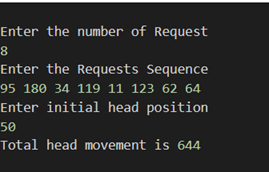
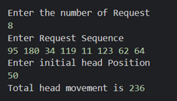
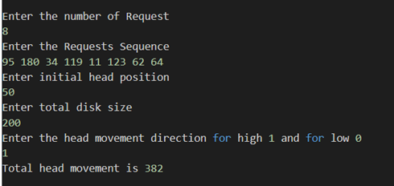
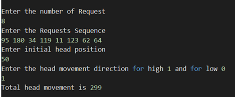
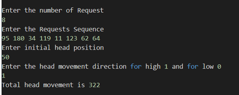

# OS-EX.11-IMPLEMENTATION-OF-DISK-SCHEDULING-ALGORITHMS

## FCFS (First come first serve)

## AIM:
To implement FCFS (First come first serve) Disk scheduling algorithm in C programming.

## ALGORITHM:
Step 1: Initialize an array RQ to store disk requests and variables n, TotalHeadMoment, and initial.

Step 2: Prompt the user to input the number of requests (n) and the request sequence (RQ).

Step 3: Prompt the user to input the initial head position (initial).

Step 4: Calculate TotalHeadMoment by iterating through the requests, adding the absolute difference between each request and the current head position to TotalHeadMoment, and updating the head position.

Step 5: Print the TotalHeadMoment as the result of the FCFS disk scheduling.
## PROGRAM:
```
#include<stdio.h>
#include<stdlib.h>
int main()
{
    int RQ[100],i,n,TotalHeadMoment=0,initial,count=0;
    printf("Enter the number of Requests\n");
    scanf("%d",&n);
    printf("Enter the Requests sequence\n");
    for(i=0;i<n;i++)
     scanf("%d",&RQ[i]);
    printf("Enter initial head position\n");
    scanf("%d",&initial);
    // logic for sstf disk scheduling
        /* loop will execute until all process is completed*/
    while(count!=n)
    {
        int min=1000,d,index;
        for(i=0;i<n;i++)
        {
           d=abs(RQ[i]-initial);
           if(min>d)
           {
               min=d;
               index=i;
           }
        }
        TotalHeadMoment=TotalHeadMoment+min;
        initial=RQ[index];
        // 1000 is for max
        // you can use any number
        RQ[index]=1000;
        count++;
    }
    printf("Total head movement is %d",TotalHeadMoment);
    return 0;
}

```
## OUTPUT:


## RESULT:
Thus the implementation of FCFS (First come first serve) Disk scheduling algorithm in C programming is done successfully.
## SSTF (Short seek time first )
## AIM:
To implement SSTF (Short seek time first ) Disk scheduling algorithm in C programming.
## ALGORITHM:
Step 1: Initialize variables and arrays for requests, total head movement, initial head position, and a counter.

Step 2: Input the number of requests, the request sequence, and the initial head position from the user.

Step 3: Find the nearest request by looping through the requests, calculating the absolute difference from the current head position, and updating the head position based on the closest request.

Step 4: Repeat this process until all requests are processed, marking completed requests with a large number.

Step 5: Print the total head movement as the result of the SSTF disk scheduling.
## PROGRAM:
```
#include<stdio.h>
#include<stdlib.h>
int main()
{
    int RQ[100],i,n,TotalHeadMoment=0,initial,count=0;
    printf("Enter the number of Requests\n");
    scanf("%d",&n);
    printf("Enter the Requests sequence\n");
    for(i=0;i<n;i++)
     scanf("%d",&RQ[i]);
    printf("Enter initial head position\n");
    scanf("%d",&initial); 
    // logic for sstf disk scheduling 
        /* loop will execute until all process is completed*/
    while(count!=n)
    {
        int min=1000,d,index;
        for(i=0;i<n;i++)
        {
           d=abs(RQ[i]-initial);
           if(min>d)
           {
               min=d;
               index=i;
           } 
        }
        TotalHeadMoment=TotalHeadMoment+min;
        initial=RQ[index];
        // 1000 is for max
        // you can use any number
        RQ[index]=1000;
        count++;
    } 
    printf("Total head movement is %d",TotalHeadMoment);
    return 0;
}
```
## OUTPUT:

## RESULT:
Thus the implementation of SSTF (Short seek time first ) Disk scheduling algorithm in C programming is done successfully.
## Scan Or Elevator
## AIM:
To implement Scan Or Elevator Disk scheduling algorithm in C programming.
## ALGORITHM:
Step 1: Initialize variables and arrays for requests, total head movement, initial head position, disk size, and the head movement direction.

Step 2: Input the number of requests, the request sequence, initial head position, total disk size, and the head movement direction from the user.

Step 3: Sort the request array in ascending order to facilitate the SCAN algorithm.

Step 4: Find the index where the initial head position lies in the sorted request array and calculate head movements in the chosen direction (high or low) while iterating through the requests.

Step 5: Calculate the total head movement by summing the absolute differences in head positions and print the result as the total head movement for the SCAN disk scheduling algorithm.
## PROGRAM:
```
#include<stdio.h>
#include<stdlib.h>
int main()
{
    int RQ[100],i,j,n,TotalHeadMoment=0,initial,size,move;
    printf("Enter the number of Requests\n");
    scanf("%d",&n);
    printf("Enter the Requests sequence\n");
    for(i=0;i<n;i++)
     scanf("%d",&RQ[i]);
    printf("Enter initial head position\n");
    scanf("%d",&initial);
    printf("Enter total disk size\n");
    scanf("%d",&size);
    printf("Enter the head movement direction for high 1 and for low 0\n");
    scanf("%d",&move); 
    // logic for Scan disk scheduling
        /*logic for sort the request array */
    for(i=0;i<n;i++)
    {
        for(j=0;j<n-i-1;j++)
        {
            if(RQ[j]>RQ[j+1])
            {
                int temp;
                temp=RQ[j];
                RQ[j]=RQ[j+1];
                RQ[j+1]=temp;
            }
        }
    }
    int index;
    for(i=0;i<n;i++)
    {
        if(initial<RQ[i])
        {
            index=i;
            break;
        }
    } 
    // if movement is towards high value
    if(move==1)
    {
        for(i=index;i<n;i++)
        {
            TotalHeadMoment=TotalHeadMoment+abs(RQ[i]-initial);
            initial=RQ[i];
        }
        //  last movement for max size 
        TotalHeadMoment=TotalHeadMoment+abs(size-RQ[i-1]-1);
        initial = size-1;
        for(i=index-1;i>=0;i--)
        {
             TotalHeadMoment=TotalHeadMoment+abs(RQ[i]-initial);
             initial=RQ[i]; 
        }
    }
    // if movement is towards low value
    else
    {
        for(i=index-1;i>=0;i--)
        {
            TotalHeadMoment=TotalHeadMoment+abs(RQ[i]-initial);
            initial=RQ[i];
        }
        //  last movement for min size 
        TotalHeadMoment=TotalHeadMoment+abs(RQ[i+1]-0);
        initial =0;
        for(i=index;i<n;i++)
        {
             TotalHeadMoment=TotalHeadMoment+abs(RQ[i]-initial);
             initial=RQ[i]; 
        }
    }
    
    printf("Total head movement is %d",TotalHeadMoment);
    return 0;
}
```
## OUTPUT:

## RESULT:
Thus the implementation of Scan Or Elevator Disk scheduling algorithm in C programming is done successfully.

## C-SCAN
## AIM:
To implement C-SCAN Disk scheduling algorithm in C programming.
## ALGORITHM:
Step 1: Initialize variables and arrays for requests, total head movement, initial head position, disk size, and the head movement direction.

Step 2: Input the number of requests, the request sequence, initial head position, total disk size, and the head movement direction from the user.

Step 3: Sort the request array in ascending order to facilitate the SCAN algorithm.

Step 4: Find the index where the initial head position lies in the sorted request array and calculate head movements in the chosen direction (high or low) while iterating through the requests.

Step 5: Calculate the total head movement by summing the absolute differences in head positions and print the result as the total head movement for the SCAN disk scheduling algorithm.

## PROGRAM:
```
#include<stdio.h>
#include<stdlib.h>
int main()
{
    int RQ[100],i,j,n,TotalHeadMoment=0,initial,size,move;
    printf("Enter the number of Requests\n");
    scanf("%d",&n);
    printf("Enter the Requests sequence\n");
    for(i=0;i<n;i++)
     scanf("%d",&RQ[i]);
    printf("Enter initial head position\n");
    scanf("%d",&initial);
    printf("Enter total disk size\n");
    scanf("%d",&size);
    printf("Enter the head movement direction for high 1 and for low 0\n");
    scanf("%d",&move); 
    // logic for C-Scan disk scheduling 
        /*logic for sort the request array */
    for(i=0;i<n;i++)
    {
        for( j=0;j<n-i-1;j++)
        {
            if(RQ[j]>RQ[j+1])
            {
                int temp;
                temp=RQ[j];
                RQ[j]=RQ[j+1];
                RQ[j+1]=temp;
            }
        }
    }
    int index;
    for(i=0;i<n;i++)
    {
        if(initial<RQ[i])
        {
            index=i;
            break;
        }
    } 
    // if movement is towards high value
    if(move==1)
    {
        for(i=index;i<n;i++)
        {
            TotalHeadMoment=TotalHeadMoment+abs(RQ[i]-initial);
            initial=RQ[i];
        }
        //  last movement for max size 
        TotalHeadMoment=TotalHeadMoment+abs(size-RQ[i-1]-1);
        /*movement max to min disk */
        TotalHeadMoment=TotalHeadMoment+abs(size-1-0);
        initial=0;
        for( i=0;i<index;i++)
        {
             TotalHeadMoment=TotalHeadMoment+abs(RQ[i]-initial);
             initial=RQ[i]; 
        }
    }
    // if movement is towards low value
    else
    {
        for(i=index-1;i>=0;i--)
        {
            TotalHeadMoment=TotalHeadMoment+abs(RQ[i]-initial);
            initial=RQ[i];
        }
        //  last movement for min size 
        TotalHeadMoment=TotalHeadMoment+abs(RQ[i+1]-0);
        /*movement min to max disk */
        TotalHeadMoment=TotalHeadMoment+abs(size-1-0);
        initial =size-1;
        for(i=n-1;i>=index;i--)
        {
             TotalHeadMoment=TotalHeadMoment+abs(RQ[i]-initial);
             initial=RQ[i]; 
        }
    }
    printf("Total head movement is %d",TotalHeadMoment);
    return 0;
}
```
## OUTPUT:

## RESULT:
Thus the implementation of C-SCAN Disk scheduling algorithm in C programming is done successfully.
## Look
## AIM:
To implement look Disk scheduling algorithm in C programming.
## ALGORITHM:
Step 1: Initialize variables and arrays for requests, total head movement, initial head position, disk size, and the head movement direction.

Step 2: Input the number of requests, the request sequence, initial head position, total disk size, and the head movement direction from the user.

Step 3: Sort the request array in ascending order to facilitate the LOOK algorithm.

Step 4: Find the index where the initial head position lies in the sorted request array and calculate head movements in the chosen direction (high or low) while iterating through the requests.

Step 5: Calculate the total head movement by summing the absolute differences in head positions and print the result as the total head movement for the LOOK disk scheduling algorithm.
## PROGRAM:
```
#include<stdio.h>
#include<stdlib.h>
int main()
{
    int RQ[100],i,j,n,TotalHeadMoment=0,initial,size,move;
    printf("Enter the number of Requests\n");
    scanf("%d",&n);
    printf("Enter the Requests sequence\n");
    for(i=0;i<n;i++)
     scanf("%d",&RQ[i]);
    printf("Enter initial head position\n");
    scanf("%d",&initial);
    printf("Enter total disk size\n");
    scanf("%d",&size);
    printf("Enter the head movement direction for high 1 and for low 0\n");
    scanf("%d",&move); 
    // logic for look disk scheduling 
        /*logic for sort the request array */
    for(i=0;i<n;i++)
    {
        for(j=0;j<n-i-1;j++)
        {
            if(RQ[j]>RQ[j+1])
            {
                int temp;
                temp=RQ[j];
                RQ[j]=RQ[j+1];
                RQ[j+1]=temp;
            }
        }
    }
    int index;
    for(i=0;i<n;i++)
    {
        if(initial<RQ[i])
        {
            index=i;
            break;
        }
    } 
    // if movement is towards high value
    if(move==1)
    {
        for(i=index;i<n;i++)
        {
            TotalHeadMoment=TotalHeadMoment+abs(RQ[i]-initial);
            initial=RQ[i];
        } 
        for(i=index-1;i>=0;i--)
        {
             TotalHeadMoment=TotalHeadMoment+abs(RQ[i]-initial);
             initial=RQ[i];
        }
    }
    // if movement is towards low value
    else
    {
        for(i=index-1;i>=0;i--)
        {
            TotalHeadMoment=TotalHeadMoment+abs(RQ[i]-initial);
            initial=RQ[i];
        }
        
        for(i=index;i<n;i++)
        {
             TotalHeadMoment=TotalHeadMoment+abs(RQ[i]-initial);
             initial=RQ[i]; 
        }
    }
    printf("Total head movement is %d",TotalHeadMoment);
    return 0;
}
```
## OUTPUT:

## RESULT:
Thus the implementation of look Disk scheduling algorithm in C programming is done successfully.
## C-Look
## AIM:
To implement C-Look Disk scheduling algorithm in C programming.
## ALGORITHM:
Step 1: Initialize variables and arrays for requests, total head movement, initial head position, disk size, and the head movement direction.

Step 2: Input the number of requests, the request sequence, initial head position, total disk size, and the head movement direction from the user.

Step 3: Sort the request array in ascending order to facilitate the LOOK algorithm.

Step 4: Find the index where the initial head position lies in the sorted request array and calculate head movements in the chosen direction (high or low) while iterating through the requests.

Step 5: Calculate the total head movement by summing the absolute differences in head positions and print the result as the total head movement for the LOOK disk scheduling algorithm.
## PROGRAM:
```
#include<stdio.h>
#include<stdlib.h>
int main()
{
    int RQ[100],i,j,n,TotalHeadMoment=0,initial,size,move;
    printf("Enter the number of Requests\n");
    scanf("%d",&n);
    printf("Enter the Requests sequence\n");
    for(i=0;i<n;i++)
     scanf("%d",&RQ[i]);
    printf("Enter initial head position\n");
    scanf("%d",&initial);
    printf("Enter total disk size\n");
    scanf("%d",&size);
    printf("Enter the head movement direction for high 1 and for low 0\n");
    scanf("%d",&move); 
    // logic for C-look disk scheduling 
        /*logic for sort the request array */
    for(i=0;i<n;i++)
    {
        for( j=0;j<n-i-1;j++)
        {
            if(RQ[j]>RQ[j+1])
            {
                int temp;
                temp=RQ[j];
                RQ[j]=RQ[j+1];
                RQ[j+1]=temp;
            }
        }
    }
    int index;
    for(i=0;i<n;i++)
    {
        if(initial<RQ[i])
        {
            index=i;
            break;
        }
    } 
    // if movement is towards high value
    if(move==1)
    {
        for(i=index;i<n;i++)
        {
            TotalHeadMoment=TotalHeadMoment+abs(RQ[i]-initial);
            initial=RQ[i];
        } 
        for( i=0;i<index;i++)
        {
             TotalHeadMoment=TotalHeadMoment+abs(RQ[i]-initial);
             initial=RQ[i]; 
        }
    }
    // if movement is towards low value
    else
    {
        for(i=index-1;i>=0;i--)
        {
            TotalHeadMoment=TotalHeadMoment+abs(RQ[i]-initial);
            initial=RQ[i];
        } 
        for(i=n-1;i>=index;i--)
        {
             TotalHeadMoment=TotalHeadMoment+abs(RQ[i]-initial);
             initial=RQ[i]; 
        }
    }
    printf("Total head movement is %d",TotalHeadMoment);
    return 0;
}
```
## OUTPUT :


## RESULT:
Thus the implementation of C-look Disk scheduling algorithm in C programming is done successfully.